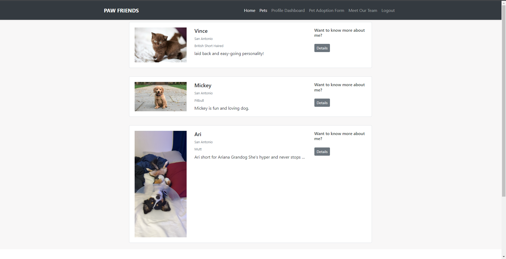

# Paw Friends 

## Description
Pawfriends a website that users can post a rescued pet and also find a pet to adopt. Future development will involve a pet application form and a messenger system to adopt a pet.

## Deployed Site
[https://pawfriends.herokuapp.com/](https://pawfriends.herokuapp.com/)

## Table of Contents
- [Installation](#installation)
- [Usage](#usage)
- [License](#license)
- [Contributing](#contributing)
- [Tests](#tests)
- [Questions](#questions)

## Installation
Install from github. Run an "npm init". Then run an "npm i" to install the packages used. After that open your mysql client and source the schema located in the db folder. After that, run the seed js files by typing "node seeds/seed.js". Then you are ready to run the server with "npm start".

## Usage
To use sign up for an account and make posts

## License
[http://www.wtfpl.net/about/](http://www.wtfpl.net/about/)  
~~~
      DO WHAT THE FUCK YOU WANT TO PUBLIC LICENSE 
      Version 2, December 2004 

Copyright (C) 2004 Sam Hocevar <sam@hocevar.net> 

Everyone is permitted to copy and distribute verbatim or modified 
copies of this license document, and changing it is allowed as long 
as the name is changed. 

DO WHAT THE FUCK YOU WANT TO PUBLIC LICENSE 
TERMS AND CONDITIONS FOR COPYING, DISTRIBUTION AND MODIFICATION 

0. You just DO WHAT THE FUCK YOU WANT TO.
~~~

## Contributing
If you would like to contribute contact us via github or email

## Tests
To test use the seed data if you would like and then add pets

## Questions
For any questions contact us on:  
[Kavitha Rajesh](https://github.com/Kaviambi)  
[Caleb Carnett](https://github.com/calebcarnett)  
[Mitch Harper](https://github.com/MitchH10)  
[Dominic Teran](https://github.com/Dom231)  

